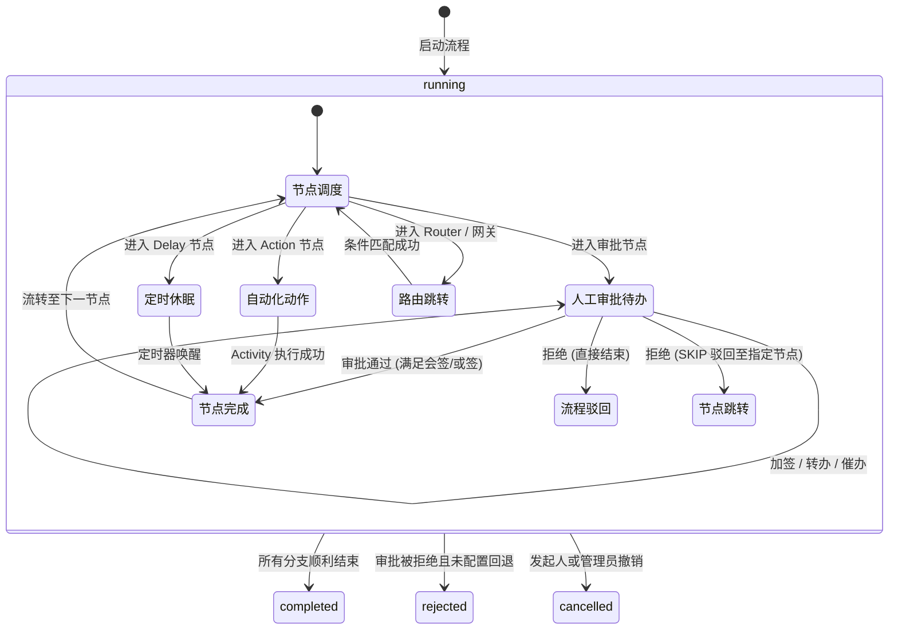

# 系统架构与确定性执行

本文档深入阐述 `wflow-platform` 的底层设计哲学与状态机模型。

---

## 1. 为什么选择 Temporal

在传统的企业级审批引擎（如 Flowable、Camunda 7、Activiti）中，流程流转强依赖于**关系型数据库的实时轮询与行级悲观锁**：
1. **数据库负担重**：一个简单的多人会签流程流转，需要触发数十次跨表的 `INSERT`/`UPDATE`（涉及 `ACT_RU_TASK`, `ACT_RU_EXECUTION`, `ACT_RU_VARIABLE`, `ACT_HI_*` 等）。
2. **长时任务开销**：对于待办超时提醒、定时器等待，Flowable 依赖后台 `AsyncJobExecutor` 定期轮询扫描死锁与到期 Job，随着流程实例增多，数据库读写与死锁风险急剧上升。
3. **语言栈割裂**：现代前端/全栈体系多为 TypeScript，而 Flowable 强制捆绑 JVM 生态，导致企业需要维护沉重的 Java 中间件，并在跨语言调用时处理序列化与事务边界问题。

### Temporal 的破局之道
- **Durable Execution（持久化执行）**：代码本身就是状态机。在 Temporal Workflow 中，代码被挂起（如等待审批 Signal 或 `sleep` 7 天）时，不占用任何内存或线程资源，无需数据库轮询。
- **Replay（重放机制）**：基于 Event Sourcing 原理，系统发生崩溃或服务重启时，工作流引擎通过事件流从头快速重放还原局部变量和执行上下文，保证 100% 的故障自愈与强一致性。
- **TypeScript 原生**：前后端与工作流引擎共享同一套类型系统与校验逻辑，彻底消除语言鸿沟。

---

## 2. 整体系统架构图

```mermaid
flowchart TB
    subgraph 前端应用层 (apps/web, apps/web-react)
        UI[Vue 3 / React 可视化设计器 / 工作台]
        ClientAPI[Axios REST API]
        UI --> ClientAPI
    end

    subgraph 流程宿主服务层 (apps/server)
        Gateway[HTTP 协议网关 /express]
        Store[(本地 SQLite / 生产 PostgreSQL)]
        Adapters[Host Adapters 宿主适配器]
        
        Gateway --> Adapters
        Gateway --> Store
    end

    subgraph 核心编排引擎 (wflow-core)
        WfClient[WorkflowEngineClient]
        Worker[Workflow Worker 运行时]
        Workflow[genericWorkflowV1 确定性状态机]
        Activities[Engine Activities 外部动作执行器]
        
        Adapters --> WfClient
        Worker --> Workflow
        Workflow --> Activities
    end

    subgraph 分布式调度系统
        TemporalCluster[(Temporal Server 集群 / 本地测试服务)]
    end

    ClientAPI -->|REST HTTP| Gateway
    WfClient -->|gRPC Signal / Update| TemporalCluster
    TemporalCluster -->|Task Queue Dispatch| Worker
    Activities -->|回调业务副作用| Adapters
    Activities -->|投影事件/待办通知| Store
```

---

## 3. 架构分层与核心职责

### 3.1 核心 SDK 层 (`wflow-core`，独立仓库)
- **纯粹性**：SDK 完全**无数据库、无网络 I/O、无外部业务依赖**。
- **确定性流程定义 (`genericWorkflowV1`)**：
  - 严格遵守 Temporal 确定性约束（禁止使用 `Math.random()`, `Date.now()`, 系统环境变量或外部直接请求）。
  - 处理分支路由（排他 XOR、并行 AND、条件包容 OR）、多维动态跳转（Router）、加签、转办、按比例会签与超时自动处理。
- **指令与命令协议 (`protocol.ts` & `tasks.ts`)**：
  - 统一通过 Temporal **Update** 原语处理业务命令（`approve`, `reject`, `claim`, `transfer`, `addAssignee`, `returnTo` 等），保证命令提交的**原子强一致性与即时返回**。

### 3.2 宿主适配层 (`apps/server`)
- **Host Adapters（宿主适配器）**：
  - **`definitions`**：读取与版本化流程模型定义。
  - **`resolveAssignees`**：解析复杂组织关系（部门主管、递归上级、表单选人、角色组匹配）。
  - **`authorize`**：基于操作者身份校验审批权限。
  - **`publishEvent`**：领域事件投影（将 Task 创建、流转状态、节点完成等派发至待办列表和通知系统）。
  - **`integrate`**（可选）：执行节点/流程 HTTP 监听器与跨实例 SIGNAL 投递。
  - **`syncBusinessData`**（可选）：应用 `ProcSetting.formSync` 业务数据同步规则。
- **读写分离与 CQRS**：
  - **写模型（Write Model）**：直接向 Temporal 提交命令，由 Temporal 保障分布式事务和顺序性。
  - **读模型（Read Model）**：宿主监听工作流派发的事件投影，落盘至高效的关系型索引库（如 SQLite/PostgreSQL），专门支撑前端列表查询、搜索与导出。

---

## 4. 核心执行状态机

工作流实例与任务遵循严格的状态流转契约：



---

## 5. 安全性与边界原则

1. **条件求值是确定性的**：默认路径是结构化条件 AST（`eq/gt/in/between/and/or/...`）的白名单求值，不执行任意字符串；
   与 Java 对等的 `eval`（EL/JS）分支目前在引擎/宿主内编译执行（`translateSpel` 常用面或 `new Function`），
   **沙箱强度仍受确定性执行预算约束**，属已知差距，详见 [sdk-roadmap.md](./sdk-roadmap.md)。
2. **幂等性保障**：每一个业务指令均须包含 `requestId`，Temporal 工作流保证相同请求 ID 的重复调用绝对幂等，天然防抖与抗网络抖动。
3. **数据隔离与脱敏**：敏感数据（如用户密码、敏感薪资）严禁进入 Temporal History，工作流状态仅流转业务主键与计算所需最小集。
